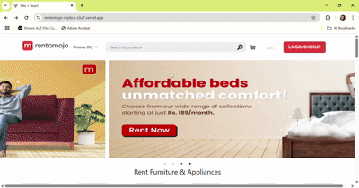
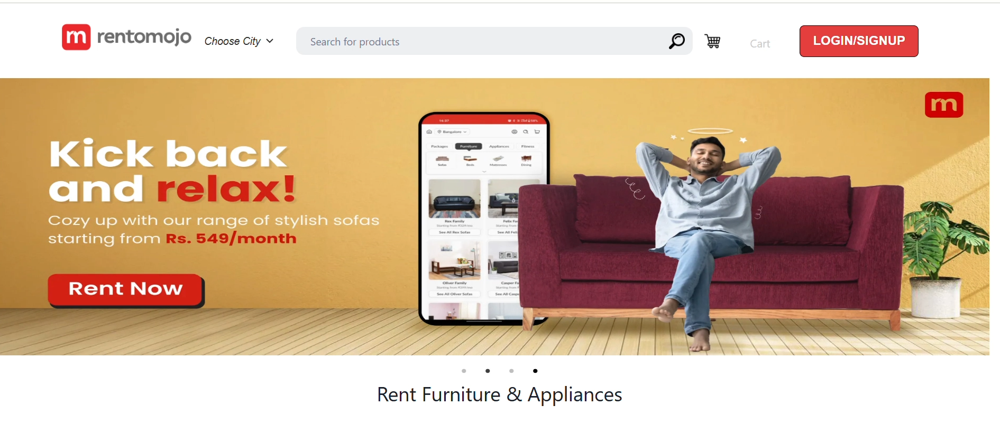
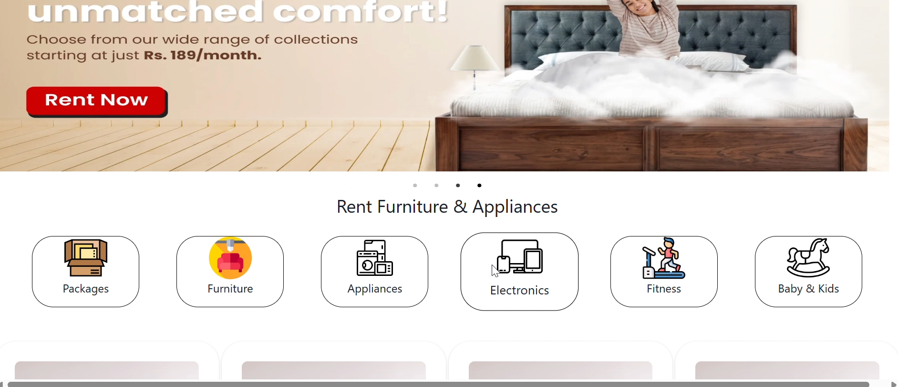
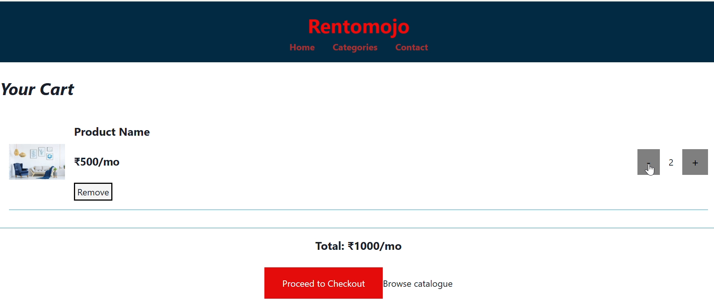
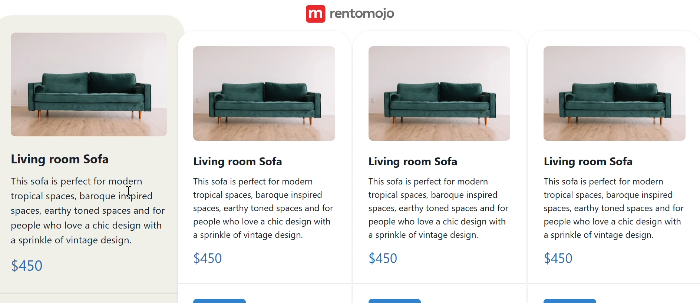
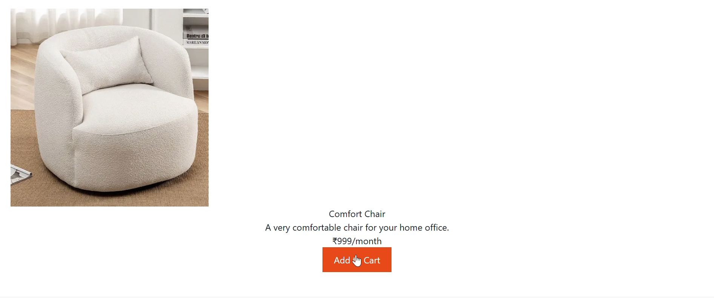

 # RENTOMOJO-Inspired Web Interface 
 A modern an responsive front-end design for a furniture rental platform,focused on delivering a seamless user experience.

## 🎬 Demo Preview

 
*Developed a fully responsive front page UI for a furniture rental websiteinspired by ‘Rentomojo’, utilizing HTML, CSS, JavaScript, React.js, and Node.js.*

 *Built a clean, intuitive homepage layout with dynamic navigation, responsive cards, and clear call-to-action sections to simulate a real-world e-commerce.*
 
 *Emphasized UX principles through structured layout, consistent styling, and component-based design using React.*
 
 *Crafted reusable UI elements (navbar, banners, product sections) to enhance maintainability and scalability.*
 
 *Strengthened frontend development skills with a focus on component reusability, state management, and visual consistency*

 Project link: https://rentomojo-replica-s3u7.vercel.app

 ## 🖼 App Screenshots

Here are some screens from the app:

### 🏠 Homepage

### 🛒 Cart Page

### 📄  ALL Product 

### ✅ Product Details

